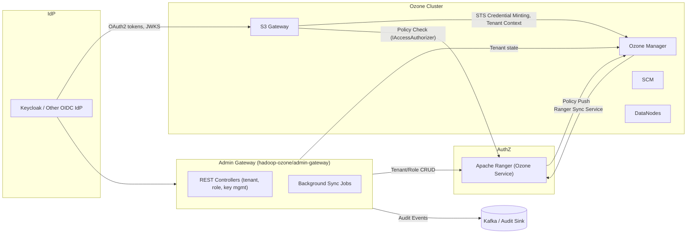

# Ozone S3 Gateway IAM & Multi-Tenancy Proposal

## 1. Overview & Goals
- Deliver a fast MVP that brings OAuth2-based authentication and Ranger-backed authorization to Apache Ozone’s S3 Gateway while preserving existing S3-compatible semantics.
- Provide a modular Admin Gateway under `hadoop-ozone/admin-gateway/` that manages tenants, identities, roles, secrets, and policy lifecycle.
- Support multi-tenancy end-to-end: onboarding tenants, segregating credentials, enforcing per-tenant quotas and Ranger policies, and exporting tenant-aware audit logs.
- Prepare a migration path toward SpiceDB-backed authorization and AWS-style ACL/bucket policies without disrupting production traffic.

## 2. Modern IAM Feature Set (MVP-Incremental)
| Feature | MVP Treatment | Justification |
| --- | --- | --- |
| OAuth2/OIDC Authentication | OAuth2 resource server filter in S3G; optional Keycloak IdP | Standardizes identity tokens, eases federation and rotates secrets less often than basic auth. |
| Role-Based Access Control (RBAC) | Ranger roles per tenant; Admin Gateway manages assignments | Ranger gives coarse-to-fine control and aligns with Ozone multi-tenant manager semantics. |
| Fine-Grained Bucket/Object Permissions | Ranger policies scoped to buckets/prefixes; S3G request context passes tenant/bucket/object | Necessary for parity with S3 ACLs and cross-tenant isolation. |
| External IdP Integration (OIDC/SAML) | OAuth2 introspection and IdP metadata managed centrally; Keycloak profile recommended for MVP | Enables enterprise SSO, MFA, and compliance (SCIM provisioning). |
| Audit Logging & Policy Enforcement | Leverage Ranger audit + Ozone OM audit; consolidate to Admin Gateway audit topic | Critical for SOC2/ISO controls and debugging misconfigurations. |
| Key/Secret Management | Admin Gateway issues scoped access keys, stores encrypted in Ranger or KMS-backed DB | Short-lived credentials and rotation policies reduce blast radius. |
| Tenant Isolation Guardrails | Namespace separation (per-tenant prefix), per-tenant quotas, per-tenant Ranger services | Prevents noisy-neighbor issues and compliance data leaks. |

## 3. Target Architecture (MVP)


### Interaction Highlights
- **Authentication:** S3G validates OAuth2 JWT access tokens (or session tokens) via JWKS/Introspection before mapping to Ozone access IDs.
- **Authorization:** S3G continues to rely on `IAccessAuthorizer` hooks; for MVP, backed by Ranger’s existing service. Requests include tenant ID and bucket/object path, letting Ranger enforce prefix-level policies.
- **Admin Gateway:** Coordinates tenant lifecycle, role assignment, key rotation, and policy bootstrapping. Exposes REST endpoints consumed by platform automation or UI.
- **Audit & Telemetry:** Ranger audits, S3G request logs, and Admin Gateway events shipped to a centralized sink (Kafka/Elasticsearch) for traceability.

## 4. Storage vs BSS Ownership Boundaries
- **Operating model:** BSS owns customer-facing identity lifecycle (user signup, federation, high-level product roles), while the storage team owns infrastructure-facing authorization (bucket/object policies, access keys, enforcement).
- **Source of truth split:**
  - BSS maintains user-to-business-role mappings and presents them via APIs or directory groups.
  - Admin Gateway ingests those assignments, resolves them into tenant-scoped roles (Ranger/SpiceDB), and manages storage-scoped credentials.
  - Ranger/SpiceDB remain the enforcement engine invoked by Ozone components; BSS never bypasses storage-layer checks.
- **Integration contract:** Expose Admin Gateway REST endpoints/SCIM bridge for BSS to push role bindings, request access keys, and query audit data. Storage team validates inputs, normalizes tenant IDs, and generates immutable policy IDs for traceability.

| Responsibility | BSS Frontend Team | Storage/Ozone Team |
| --- | --- | --- |
| External identity federation | Configure IdP (Keycloak/Okta), manage MFA, SCIM | Consume IdP metadata, enforce token validation policy |
| Business RBAC model | Define product roles (Engineer, Analyst) and approval workflow | Map product roles → storage roles (`tenant:analytics:read-only`) |
| Tenant onboarding UX | Provide customer portal to request tenants/buckets | Operate Admin Gateway APIs that actually create tenants |
| Access key issuance | Request short-lived credentials via Admin Gateway, surface to users | Validate scopes, mint/rotate keys, store encrypted |
| Policy enforcement | None (read-only visibility of decisions) | Maintain Ranger/SpiceDB policies, evaluate requests, audit |
| Audit & compliance | Consume summarized audit feed for portal | Produce detailed audit events, ensure retention & integrity |

### Integration Patterns With BSS RBAC
1. **Group/Role Synchronization:** BSS publishes group membership to IdP (e.g., Keycloak realm roles). Admin Gateway maps incoming groups to tenant roles through configurable lookup. Recommended for MVP due to minimal coupling.
2. **Direct Policy Push API:** Admin Gateway exposes `/api/v1/tenants/{id}/bindings` endpoints. BSS calls these after approvals. Admin Gateway validates requested actions against allowlist (e.g., only storage team can create `admin` bindings).
3. **Delegated Authorization Hooks:** Future SpiceDB deployment can allow BSS to author coarse-grained tuples (e.g., membership) while storage team maintains bucket/object permissions. Use tenant-specific namespaces to prevent privilege escalation.
4. **Audit Subscription:** Provide Kafka topic or webhook tailored for BSS UI (summaries, no sensitive object names) while storage retains full-fidelity logs.

### Guardrails & Open Questions
- Ensure BSS cannot create or escalate storage-only roles (`tenant:*:storage-admin`). Enforce via schema-level validation.
- Clarify SLAs: who handles on-call for Admin Gateway failures vs. BSS portal downtime?
- Decide whether BSS-managed RBAC supports object-level sharing; if so, coordinate on prefix taxonomy to avoid conflicting denies.
- Align release cadence: contract versioning for APIs/events to minimize cross-team breakage.

## 5. Approach Comparison
| Approach | Pros | Cons / Risks | Performance & Scalability Notes |
| --- | --- | --- | --- |
| **Extend Ozone Multi-Tenancy + Ranger (MVP)** | Leverages existing `OMMultiTenantManager`, Ranger plugin, mature policy engine & audits; quickest path to market; no new infra | Ranger policy model less expressive than SpiceDB; policy sync latency; Ranger UI automation required | Ranger scales horizontally with Solr-backed audits; watch policy sync latency (default 30s) and tune caches. |
| **Ranger + Keycloak (OAuth2)** | Adds enterprise SSO, JWT-based auth, refresh token flows; integrates with SCIM/MFA | Requires operating Keycloak cluster; token validation needs caching (e.g. nimbus JOSE) | Token verification is CPU-bound; use JWKS caching + thread pools in S3G. |
| **SpiceDB Authorization (Post-MVP)** | Tuple-based graph model handles complex sharing hierarchies and multi-tenant relationships; low-latency checks via `Check`/`Lookup` | Requires new infra and operational expertise; need custom policy management layer | Sub-millisecond checks with in-memory dispatchers; use zedtokens for read-your-writes; watch tuple cardinality. |
| **Keycloak Authorization Services** | Single system for auth + fine-grained authz; built-in UMA | Less flexible for S3-specific semantics; scaling policies beyond 10k resources is painful | Policy evaluation local to Keycloak; may add latency unless cached. |

## 6. MVP with Apache Ranger

### 6.1 Scope & Flow
1. **Authentication**: S3 clients obtain OAuth2 access tokens from Keycloak (OIDC) using client credentials or STS delegation. S3G adds a `BearerTokenAuthFilter` that validates the JWT and maps `sub`/`tenant` claims to Ozone access IDs.
2. **Authorization**: S3G builds an `OzoneObj` with tenant, bucket, and key path, and calls `IAccessAuthorizer#checkAccess`. The Ranger plugin (already wired in OM) resolves policies and returns allow/deny.
3. **Admin Gateway**: Provides endpoints to create tenants, bind IdP groups to Ranger roles, and mint scoped access keys. It updates both Ozone (via OM REST/gRPC) and Ranger (via plugin REST APIs).
4. **Audit**: Ranger audit logs shipped to Solr/Log4j sink; Admin Gateway emits structured events. S3G logs include token ID, tenant, bucket, action, and policy ID (when available).

### 6.2 Module Changes (`hadoop-ozone/admin-gateway/`)
```
hadoop-ozone/admin-gateway/
 └── src/main/java/org/apache/ozone/admin/gateway/
     ├── GatewayServer.java                (Jetty/Jersey bootstrap)
     ├── config/
     │   ├── GatewayConfiguration.java     (wraps OzoneConfiguration)
     │   └── OAuthClientConfig.java        (IdP endpoints, JWKS cache)
     ├── auth/
     │   ├── OAuth2Client.java             (token exchange, introspection)
     │   └── AdminGatewayAuthorizer.java   (enforce RBAC on admin APIs)
     ├── controller/
     │   ├── TenantController.java         (tenant CRUD)
     │   ├── RoleController.java           (role binding)
     │   └── AccessKeyController.java      (STS-like credentials)
     ├── service/
     │   ├── TenantService.java            (talks to OM MultiTenantManager)
     │   ├── RangerPolicyService.java      (Ranger REST client)
     │   ├── CredentialService.java        (key generation, KMS integration)
     │   └── AuditService.java             (emit events)
     └── model/
         ├── TenantSpec.java
         ├── RoleBinding.java
         └── AccessKeyRequest.java
```

`pom.xml` already brings Jersey and core Ozone dependencies. Add `jersey-hk2`, `jersey-jsonb`, `nimbus-jose-jwt` for JWT handling when implementing.

### 6.3 Example Admin Gateway Endpoint (Java)
```java
@Path("/api/v1/tenants")
@Produces(MediaType.APPLICATION_JSON)
@Consumes(MediaType.APPLICATION_JSON)
public class TenantController {

  private final TenantService tenantService;

  @POST
  public Response createTenant(CreateTenantRequest request,
                               @Context SecurityContext ctx) throws IOException {
    AdminPrincipal caller = (AdminPrincipal) ctx.getUserPrincipal();
    tenantService.ensurePrivileged(caller, GatewayPermission.TENANT_ADMIN);
    TenantSummary summary = tenantService.createTenant(request);
    return Response.status(Response.Status.CREATED).entity(summary).build();
  }

  @POST
  @Path("/{tenantId}/roles/{roleName}/bindings")
  public Response bindRole(@PathParam("tenantId") String tenantId,
                           @PathParam("roleName") String roleName,
                           RoleBinding binding) throws IOException {
    tenantService.bindIdentity(tenantId, roleName, binding);
    return Response.accepted().build();
  }
}
```

### 6.4 Ranger Tenant Modeling
- **Service Definition**: Use existing `ozone` Ranger service. Enable the multi-tenancy extension in `ozone-site.xml` by setting `ozone.om.multitenancy.enabled=true`.
- **Tenants**: Represented as Ranger role namespaces, e.g. `tenant:analytics`. Admin Gateway creates:
  - `tenant:analytics:admin` role – bound to IdP group `analytics-admins`.
  - `tenant:analytics:power-user` role – bound to group `analytics-power`.
  - `tenant:analytics:read-only` role.
- **Policies**:
  - Bucket policy: resource `bucket=analytics-landing`, `object=/raw/*`, permissions `List`, `Read`, actions `GET`, `HEAD`, `List`. Assigned to `tenant:analytics:power-user`.
  - Object prefix policy: `bucket=analytics-landing`, `object=/raw/pii/*`, `Deny` for `tenant:analytics:read-only`.
  - Tenant admin policy: `admin` permissions for bucket create/delete and volume operations.
- **Policy Automation**: Admin Gateway uses Ranger REST `/public/v2/api/service` & `/role` endpoints. Maintain idempotent sync by labeling policies with custom tags (`ozone.tenant=analytics`).

### 6.5 S3G Request Flow & Hooks
1. Incoming request arrives at `S3GatewayHttpServer`.
2. New `OAuth2AuthFilter` extracts bearer token, validates against JWKS, populates `UserGroupInformation` with `shortUserName=tenantUser`.
3. `S3Gateway` builds `OzoneObj` (volume/bucket/key, tenant).
4. `OzoneClient.getObjectStore().getVolume()` triggers RPC to OM.
5. `OMMultiTenantManagerImpl` ensures tenant context; `MultiTenantAccessController` uses Ranger plugin to evaluate `checkAccess`.
6. Ranger returns allow/deny; On deny, S3G maps to `AccessDenied`.
7. Audit entries tagged with `tenantId`, `policyId`, `requestId`.

### 6.6 Configuration Samples
**`ozone-site.xml`:**
```xml
<property>
  <name>ozone.om.multitenancy.enabled</name>
  <value>true</value>
</property>
<property>
  <name>ozone.om.multitenancy.authorizer</name>
  <value>RANGER</value>
</property>
<property>
  <name>ozone.s3g.oauth2.jwks.url</name>
  <value>https://idp.example.com/realms/ozone/protocol/openid-connect/certs</value>
</property>
<property>
  <name>ozone.s3g.oauth2.audience</name>
  <value>ozone-s3</value>
</property>
<property>
  <name>ozone.s3g.authentication.type</name>
  <value>OAUTH2</value>
</property>
<property>
  <name>ozone.s3g.ranger.policy.cache.ttl</name>
  <value>30s</value>
</property>
```

**Ranger Ozone Plugin (`ranger-ozone-security.xml`):**
```xml
<property>
  <name>ranger.plugin.ozone.policy.rest.url</name>
  <value>http://ranger-admin:6080</value>
</property>
<property>
  <name>ranger.plugin.ozone.service.name</name>
  <value>ozone-prod</value>
</property>
<property>
  <name>ranger.plugin.ozone.policy.pollIntervalMs</name>
  <value>15000</value>
</property>
<property>
  <name>ranger.plugin.ozone.policy.cache.dir</name>
  <value>/var/lib/ozone/ranger-cache</value>
</property>
```

### 6.7 Build & Run Instructions
1. **Build Admin Gateway & S3G**  
   ```bash
   mvn -pl hadoop-ozone/admin-gateway -am clean package
   mvn -pl hadoop-ozone/s3gateway -am clean package
   ```
2. **Configure Cluster**  
   - Update `ozone-site.xml` and Ranger plugin configs as above.
   - Deploy Keycloak realm with `tenant` claim (realm role mapper).
3. **Start Services**  
   ```bash
   ./ozone bin/ozone --daemon om
   ./ozone bin/ozone --daemon scm
   ./ozone bin/ozone --daemon s3g
   ./ozone bin/ozone --daemon admin-gateway \
     --config /etc/ozone/admin-gateway-site.xml
   ```
4. **Seed Tenants** via Admin Gateway REST:  
   ```bash
   curl -H "Authorization: Bearer <token>" \
     -d '{"tenantId":"analytics","volume":"tenant-analytics"}' \
     https://admin-gateway.example.com/api/v1/tenants
   ```
5. **Check Policies**  
   Validate Ranger UI lists policies annotated with `ozone.tenant`.

### 6.8 Local Development & Testing
- Use `docker-compose` from `dev-support/compose/ozone` to spin up OM/SCM/DN/S3G, Ranger, Keycloak.
- Mock JWKS using WireMock for integration tests.
- Add unit tests under `hadoop-ozone/admin-gateway/src/test/java` with JerseyTest; mock Ranger via `MockWebServer`.
- Integration test: extend `ozone` acceptance tests (Robot/pytest) to cover OAuth2 auth and Ranger deny scenarios.

## 7. Migration Plan: SpiceDB + AWS-Style Policies

### 7.1 Goals
- Replace Ranger authorization with SpiceDB while retaining existing tenant constructs.
- Achieve AWS S3-compatible authorization semantics: evaluate explicit deny > bucket policy > ACL.
- Maintain dual-write during migration and allow rollback.

### 7.2 SpiceDB Schema (Zed)
```zed
definition tenant {}

definition user {
  relation member_of: tenant
  relation impersonates: user
}

definition group {
  relation tenant: tenant
  relation member: user
}

definition role {
  relation tenant: tenant
  relation assigned_to: user | group
  relation grants: permission
}

definition bucket {
  relation tenant: tenant
  relation owner: user | group | role
  relation reader: user | group | role
  relation writer: user | group | role
  permission list = reader + owner
  permission read = reader + owner
  permission write = writer + owner
}

definition object {
  relation bucket: bucket
  relation owner: user | group | role
  relation reader: user | group | role
  relation writer: user | group | role
  relation delegated: permission
  permission read = reader + bucket.read
  permission write = writer + bucket.write
  permission delete = owner + bucket.write
}

definition permission {
  relation parent: permission
}
```
- For prefix support: model pseudo-objects `object_prefix` that point to `permission` tuples with TTL to invalidate caches when policies change.
- Use `tenant` relation edges to ensure cross-tenant isolation (`Check` includes tenant context).

### 7.3 Authorization Evaluation (AWS Parity)
1. **Explicit Deny**: Maintain SpiceDB tuples with `permission=deny` and evaluate before allows. Represent denies via separate relation or metadata on tuples (requires check wrappers).
2. **Bucket Policy**:
   - Store JSON policy (AWS syntax) in Admin Gateway DB.
   - Translate into SpiceDB tuples (resource -> principal -> action + condition).
3. **ACLs**:
   - Use object-level tuples for ACL grants.
4. **Evaluation Order**:
   1. Evaluate denies (bucket policy deny, ACL deny).
   2. Evaluate allows from bucket policy.
   3. Evaluate allows from ACL.
   4. Default deny.
5. **Condition Keys**: map AWS condition keys to context:
   - `aws:PrincipalOrgID` -> tenant ID.
   - `s3:prefix` -> object path; use SpiceDB caveats with CEL to evaluate path prefixes or `ipAddress` conditions.

### 7.4 Migration Steps
1. **Prep**:
   - Deploy SpiceDB cluster (3 replicas, Postgres datastore).
   - Implement Admin Gateway SpiceDB client (using `grpc` API).
   - Add dual-write feature flag: `ozone.authorization.mode=DUAL`.
2. **Schema & Tuple Backfill**:
   - Export Ranger policies via REST, transform to tuples (service).
   - For each tenant bucket policy, create corresponding SpiceDB tuples with `WriteRelationships`.
   - Store `spicedb_migration_marker` to track progress.
3. **Dual-Write**:
   - Admin Gateway writes to both Ranger and SpiceDB; annotate tuples with version number.
   - S3G calls SpiceDB `Check` in shadow mode (results logged, not enforced).
4. **Dual-Read Shadow**:
   - Compare Ranger vs SpiceDB decisions in metrics. Alert on mismatches.
5. **Cutover**:
   - Flip `ozone.s3g.authorization.provider=SPICEDB`.
   - Keep Ranger policies frozen; maintain read-only for rollback.
6. **Rollback Plan**:
   - Re-enable Ranger provider flag; continue using Ranger caches.
   - Keep latest Ranger policies in sync by not decommissioning dual-write until stability is confirmed (2 release cycles).

### 7.5 Performance & Consistency
- Enable SpiceDB `dispatch_throughput` autoscaling.
- Use `CheckBulk` for batching S3 multi-part operations.
- Cache zedtokens per request to guarantee read-your-write when Admin Gateway updates policies.
- Monitor p95 latency (<5 ms) and tuple cardinality; partition tuples by tenant to ease GC.

## 8. Other Potential Solutions (Future Exploration)
- **OPA / Rego**: Embed OPA sidecar for policy evaluation; Admin Gateway compiles tenant-specific bundles. Adds flexibility but requires caching to avoid latency.
- **Cedar Policy Language**: Align with AWS Access Analyzer; can reuse Cedar policies for bucket authorizations with evaluation engine (e.g. `cedar-agent`).
- **Vault / KMS Integration**: Store access keys & secrets in HashiCorp Vault; use dynamic secrets for short-lived S3 credentials.
- **AWS Cognito / Okta / Azure AD**: Alternative IdPs if enterprise mandates; Admin Gateway should abstract OIDC metadata endpoints to swap easily.

## 9. Security & Compliance Checklist
- **Authentication Hardening**: Enforce TLS mutual auth between Admin Gateway and Ranger/OM; rotate OAuth2 client secrets quarterly.
- **Least Privilege**: Default deny for new tenants; require explicit policy attach before enabling bucket access.
- **Audit & Monitoring**: Centralize Ranger audit, S3G access logs, Admin Gateway events; attach correlation IDs.
- **Key Management**: Encrypt stored access keys with KMS; enforce 90-day rotation; support per-tenant customer-managed keys.
- **PII Handling**: Tag buckets containing PII; apply deny policies for cross-tenant principals; ensure audit logs avoid storing raw object paths containing PII when possible.
- **Tenant Isolation Tests**: Automated test suite to ensure tenant A credentials cannot read tenant B buckets; include negative tests in CI.
- **Compliance**: Map controls to SOC2/ISO27001; document policy change workflow (approval + change ticket).

## 10. Testing & Rollout Strategy
- **Unit Tests**: Cover Admin Gateway services, OAuth2 filter, Ranger policy client stubs.
- **Integration Tests**: End-to-end S3 API tests (PUT/GET/LIST) with OAuth2 tokens and Ranger deny scenarios; use Robot or pytest harness.
- **Load Tests**: Simulate 5–10k RPS through S3G using `s3-benchmark`; monitor auth caches and Ranger latency.
- **Staging Plan**: Deploy to staging cluster with mirrored tenant data; enable shadow SpiceDB checks early.
- **Feature Flags**: `ozone.s3g.auth.mode={KERBEROS,OAUTH2}` and `ozone.authorization.mode={RANGER,DUAL,SPICEDB}`.
- **Phased Rollout**:
  1. Internal tenants only.
  2. Opt-in external tenants.
  3. Default-on after 2 weeks of stable metrics.
- **Observability**: Expose metrics (token validation latency, Ranger decision cache hit, dual-read mismatch count) via Prometheus.

## 11. Timeline (Aggressive MVP)
| Phase | Duration | Key Outcomes |
| --- | --- | --- |
| P0 – Design & Planning | 1 week | Finalize API contracts, Ranger policy templates, IdP integration plan. |
| P1 – MVP Implementation | 3 weeks | Admin Gateway REST APIs, OAuth2 filter, Ranger automation, initial tests. |
| P2 – Hardening & Launch | 2 weeks | Load tests, audit pipeline, documentation, production rollout. |
| P3 – SpiceDB Pilot | 4 weeks (parallel) | Deploy SpiceDB, dual-write, mismatch dashboards. |
| P4 – AWS Policy Parity | 4 weeks | Implement bucket policy translator, condition key handling, cutover readiness. |

---

**Next Steps**
1. Approve module structure and configuration strategy for Admin Gateway.
2. Stand up sandbox Ranger + Keycloak + Ozone cluster to validate end-to-end MVP.
3. Begin schema design and PoC for SpiceDB dual-write to de-risk migration.
